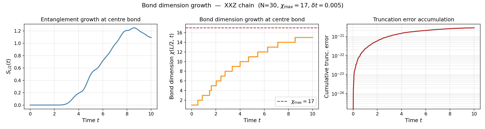
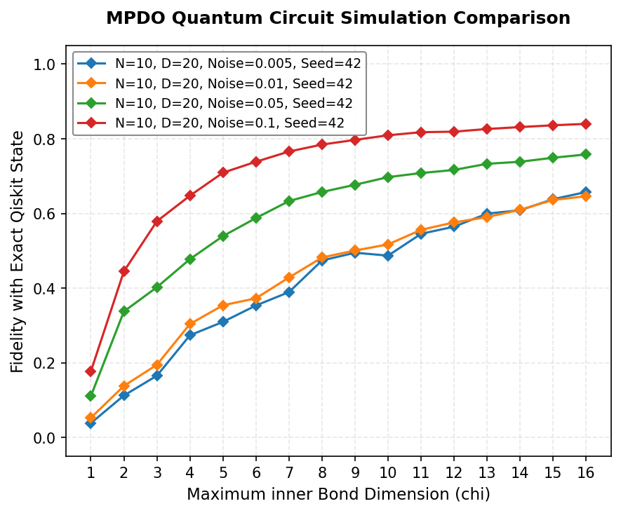

# Tensor Network Simulators

A unified Python framework for classical simulation of quantum systems using Tensor Networks, spanning two distinct physics domains.

---

## Subpackages

### `mps_mpo` — Closed Systems
Ground-state optimization and real-time dynamics of 1D spin-1/2 chains. The quantum state is represented as a Matrix Product State (MPS) in Vidal canonical form ($\Gamma$--$\Lambda$ decomposition), evolving under the anisotropic XXZ Hamiltonian:

$$H = -h_z \sum_{l} \sigma_z^{[l]} + \sum_{l} \left( J_x \sigma_x^{[l]}\sigma_x^{[l+1]} + J_y \sigma_y^{[l]}\sigma_y^{[l+1]} + J_z \sigma_z^{[l]}\sigma_z^{[l+1]} \right)$$

* **TEBD Engine**: Second-order Suzuki–Trotter real-time evolution (per-step error $\mathcal{O}(dt^3)$).
* **DMRG Engine**: Two-site variational sweeps with an iterative Lanczos eigensolver; converges to $|\Delta E| < \texttt{tol}$.

### `mpdo` — Open Systems
Noisy quantum circuit simulation where the density operator $\rho$ is represented as a Matrix Product Density Operator (MPDO). Each site tensor $T^{[k]}$ carries the shape `(χ_l, χ_r, d, κ)`, where the extra $\kappa$ index encodes classical mixing from environmental dissipation.

#### Supported Noise Channels
*All channels are single-qubit CPTP maps applied independently per qubit after each gate operation:*

| Channel | Map | Kraus Operators |
| :--- | :--- | :--- |
| **Amplitude Damping** | $\mathcal{E}(\rho) = A_0\rho A_0^\dagger + A_1\rho A_1^\dagger$ | $A_0 = \mathrm{diag}(1,\sqrt{1-\gamma})$, $A_1 = \sqrt{\gamma}\vert 0\rangle\langle 1\vert$ |
| **Dephasing** | $\mathcal{E}(\rho) = (1-\epsilon)\rho + \epsilon Z\rho Z$ | $\sqrt{1-\epsilon}I$, $\sqrt{\epsilon}Z$ |
| **Depolarizing** | $\mathcal{E}(\rho) = (1-\frac{3\epsilon}{4})\rho + \frac{\epsilon}{4}(X\rho X + Y\rho Y + Z\rho Z)$ | $\sqrt{1-\frac{3\epsilon}{4}}I$, $\sqrt{\frac{\epsilon}{4}}\{X,Y,Z\}$ |

Virtual bond dimensions are controlled by a robust **two-stage truncation protocol**: a local SVD on the $\kappa$ bond immediately following noise injection, followed by a global left-moving `QR` / right-moving `SVD` canonical sweep on the $\chi$ bonds executed once per layer.

---

---
## Validation & Benchmarks

* **`mps_mpo`**: TEBD Schmidt values and DMRG ground-state energies are rigorously benchmarked against Exact Diagonalization (ED) for system sizes $L \leq 12$.
* **`mpdo`**: Reconstructed density matrix fidelity $\mathcal{F}(\rho_\text{MPDO}, \rho_\text{Qiskit})$ is validated against exact mixed-state backends in `Qiskit Aer` across all three noise channels, circuit depths up to $D=20$, and system sizes up to $N=10$.

### MPDO Convergence Profile
The figure below illustrates the simulator's fidelity tracking performance against Qiskit Aer as a function of the maximum virtual bond dimension ($\chi_{\max}$) under varying noise parameters ($\gamma$):

The alignment confirms two key physical features: the strict entanglement cutoff tracking limits at restricted dimensions ($\chi_{\max}=16$), and noise-induced decompressibility where higher dissipation rates drive the system into low-entanglement mixed classical states that are highly optimized for low-rank matrix product representations.

---

---
## Code Architecture & API Layout

The suite is engineered using a hybrid architectural paradigm, balancing performance-optimized functional routines with descriptive, high-level interfaces across both physics domains:

* **Closed-System Engine (`mps_mpo`)**: Implements a highly efficient **functional paradigm** to eliminate overhead during deep numerical simulation loops. Pure, stateless mathematical transformations drive state manipulation:
  * `init_mps()`: Instantiates and initializes the Vidal canonical $\Gamma$--$\Lambda$ tensor chains.
  * `tebd_sweep()`: Executes local two-site Suzuki–Trotter contractions and virtual bond truncations.
  * `run_dmrg()`: Governs variational ground-state sweeps via a site-canonical Lanczos eigensolver.
* **Open-System Engine (`mpdo`)**: Encapsulates the tracking of mixed states and auxiliary environment indices within unified interfaces to simplify multi-layer circuit configurations:
  * `MPDOState`: A unified state container managing local tensor registers, tracking cutoffs ($\chi_{\max}$, $\kappa_{\max}$), unitary gate injections, and dual-stage canonicalization.
  * `KrausChannel` (ABC): An abstract base class defining a polymorphic interface for seamless configuration of local CPTP noise maps (`AmplitudeDamping`, `Dephasing`, `Depolarizing`).

*Low-level tensor contractions remain decoupled as optimized pure functions to guarantee straightforward testability, maintenance, and numerical reliability.*

## Reference

> Vidal, G. (2004). *Efficient Simulation of One-Dimensional Quantum Many-Body Systems.*
> Physical Review Letters, **93**(4), 040502.
> https://doi.org/10.1103/PhysRevLett.93.040502

---
